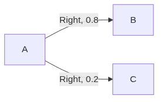

#+title: Reinforcement Learning
#+SETUPFILE: /home/praaneshnair/.config/doom/templates/org/html-preamble.org

* Introduction
 - Reinforcement learning is a branch of AI where an agent learns how to make
   decisions by interacting with its environment.
 - The goal is to learn how to take actions in order to maximize reward.
 - *Self-play* is a training method where an AI agent improves its skills by
   repeatedly competing against itself or its past versions.
** Components of RL
- Agent
  - This is the learner/decision maker.
- Environment 
  - Everything the agents interact with.
- State (S)
  - Current situation of the environment.
  - For example, in Tic Tac Toe it's a $3 \times 3$ grid (so 9 boxes) and each box
    can be ~X~, ~O~ or empty. Hence the number of states are $3^{3 \times 3}$
- Action (A)
  - Choices available to the agent.
- Policy (\pi(a|s))
  - This is the agent's way of behaving at a given time.
  - It roughly maps /states/ with /the action to be taken in those states/.
  - This is called the *actor* as it takes the current state and decides what
    action to take.
- Reward (R)
  - This is a single number sent by the environment to the agent.
  - It depends on the current *state* and *action* of the agent.
  - A negative reward is called a *penalty*. Eg. hitting a wall, losing a game,
    etc. are unfavourable results and must be penalized.
- Value
  - Rewards tell us what is good immediately, but value function tells us what
    is good in the long run.
  - It's the total reward an agent can expect to accumlate over the future,
    /starting from that state/.
  - This is called the *critic* as it scores the actions.
    
** Environment Adaptor
- These are interfaces/translators between RL agents and their environment. 
- They provide common functions across different agents and environments to make
  it normalized and consistent.
- Some common methods provided look like:
  #+begin_src python
env.reset()
env.step(action)
env.action_space
env.observation_space
  #+end_src
- Some common environment adaptors are:
  - Arcade learning Environment
  - CARLA
  - OpenAI Gym
  - OpenAI Retro
  - Opensim
  - PyGame Learning Environment
  - ViZDoom

** Deterministic vs Stochastic Policies

*** Deterministic
- Produces the exact same output for a given input
- π(s) = a
*** Stochastic / Probabilistic
- Same input can result in a varying output
- π(a|s)
- Probability of action a, given state s

** RL as a 3rd Maching Learning Paradigm
   
*** Supervised Learning
- This is where you have *labeled data* $(x,y)$, where $x$ is the input, and $y$
  is the label (or correct answer).
- The model learns a function $y = f(x)$. In other words it can map $f(x) \rightarrow y$.
- Here the model is being told the correct answer at every step, and hence tries
  to *generalize*.
- Eg. Linear/Logistic Regression, Decision Trees, Neural Networks, etc.
- Supervised learning is insufficient as it's impractical to obtain correct
  labelled examples representative of all situations in which the agent must
  act.

*** Unsupervised Learning
- This is where you have *unlabeled data* $x$.
- The model finds patterns in the data.
- Here you have a large amount of data, and you're trying to narrow it down to
  more abstract qualities to make clusters. In a way, it tries to *compress* the
  data.

*** Reinforcement Learning
- Here you have a series of actions that unfold over time.
- You're not told how good/bad each action was. You're told how good the *result*
  was.

** Foundational Pillars of Reinforcement Learning

| Pillars                                                      | Arcade Minds 2015                         | AlphaGo 2016                            |
|--------------------------------------------------------------+-------------------------------------------+-----------------------------------------|
| *Objective* (Final Goal)                                       | Complete the game with the highest score  | Win the game                            |
| *State*    (Current Condition of the Environment)              | Raw pixels inputs                         | Position of all pieces                  |
| *Action*   (A Valid Move the Agent can Take)                   | Left, right, up, down                     | Where to put the next piece down        |
| *Reward*   (A Scalar feedback signal the Environment Provides) | Score increase/decrease at each time step | 1 if you win the game and 0 if you lose |

The last 3 (state, action and reward) are components of RL.

** Key Features of RL
*** Closed Loop Interaction
- Output or response is fed back to the sender or system.
- This helps influence its later inputs.
  
*** No Direct Instructions
- It must discover which actions yield the most reward by trying them.

*** Extended Consequences
- Actions can affect immediate rewards and subsequence rewards.

** Elements of RL

| *Policy* | *What to do* i.e. how the agent should behave at a given point of time  |
| *Reward* | *What is good* i.e. the immediate goal of the RL agent                  |
| *Value*  | *What is good because it predicts reward* i.e. total accumulated reward |
| *Model*  | *What follows what* i.e. the implementation                             |

The first 3 (policy, reward and value) are components of RL. 

** Exploration and Exploitation
- Choosing actions that yield the highest immediate reward based on past
  experience is called *exploitation*.
- Trying new or less-frequent actions to discover better long-term strategies is
  called *exploration*.
- The goal is to balance exploring and exploiting.

** Main RL Approaches

RL splits into three broad approaches:

*** Value-based methods
- Learn V(s) or Q(s,a) — how good is each possible action
- Learn the values, then derive a policy from them

**** Sample Average Method
- The value is calculated by taking running average of all the rewards you've
  gotten till now:

  \[
  Q_t(a) = \frac{r_1 + r_2 + \cdots + r_k}{k}
  \]

- If you expand this \(Q_t(a)\) for \(k+1\) terms, it'd be:

  \[
  Q_t(a) = \frac{r_1 + r_2 + \cdots + r_k + r_{k+1}}{k+1}
  \]

- We know that:

  \[
  Q_k(a) = \frac{r_1 + r_2 + \cdots + r_k}{k}
  \]

  Therefore:

  \[
  r_1 + r_2 + \cdots + r_k = kQ_k(a)
  \]

- Substituting this into the \(k+1\) average:

  \[
  Q_{k+1}(a)
  = \frac{kQ_k(a) + r_{k+1}}{k+1}
  \]

- Expanding: $kQ_k(a) + r_{k+1} = \underbrace{(k+1)Q_k(a)}_{\text{old value part}} + \underbrace{\left[r_{k+1} - Q_k(a)\right]}_{\text{correction}}$

- So rearranging the original equation:

  \[
  Q_{k+1}(a)
  = Q_k(a) + \frac{1}{k+1}
  \left[r_{k+1} - Q_k(a)\right]
  \]

- Hence, the incremental update rule is:

  \[\boxed{Q_{k+1}(a) = Q_k(a) + \frac{1}{k+1} \left[r_{k+1} - Q_k(a)\right]} \]

- This can be understood as:

  \[
  \boxed{\text{New value} = \text{Old value} + \text{Correction}}
  \]

  where the correction is:

  \[
  \frac{1}{k+1}\left[r_{k+1} - Q_k(a)\right]
  \]

**** Exponentially Recency Weighted Average
- In sample average method, the value was: 
  \[\boxed{Q_{k+1}(a) = Q_k(a) + \frac{1}{k+1} \left[r_{k+1} - Q_k(a)\right]} \]
- Here, in place of $\frac{1}{k+1}$, you have a constant \alpha:
  \[\boxed{Q_{k+1}(a) = Q_k(a) + \alpha \left[r_{k+1} - Q_k(a)\right]} \]

*** Policy-based methods
- Instead of learning how good every action is, you learn the policy itself
- Learn the mapping between state → action
  ("for this state, do this action")

*** Actor-Critic methods
- Combine the two ideas above
- Actor learns the policy: a = π(s)
- Critic learns the value: Q(s,a)
  
** Episode
- An episode is a single, complete cycle of interaction between an agent and its
  environment.
- An episode starts with the starting state, and is said to have completed once
  a final state is encountered.
- If any task naturally ends, it is called *episodic*.
- For instance, a game of chess is episodic as the game does end.
- Something like managing CPU resources is *non-episodic* as there's no end.
        

* Multi-Armed Bandit Problem
** One-Arm Bandit
- This is a slot machine, which is basically a gambling device with spinning
  reels each with a bunch of symbols.
- If the symbol shown by each reel aligns and forms a certain desirable
  combination, you win a jackpot.
- The machine is called a one-arm bandit:
  - One arm because it has one lever.
  - Bandit because they were designed to take your money quickly while rarely
    repaying you with the jackpot.
    
** What the Multi-armed bandit problem means
- Here, you sit in front of a row of one-arm bandits.
- You don't know which slot machine is more rewarding.
- You have to strike a balance between:
  - *Exploit*: pull the arm that has paid off best so far
  - *Explore*: pull a different arm to learn more about it, even though it might pay less right now

* Markov Decision Process

| Symbol | Meaning                |
|--------+------------------------|
| S      | State space            |
| A      | Action space           |
| P      | Transition probability |
| R      | Reward function        |
| \gamma      | Discount factor        |

** Discount Factor
- Discount factor (0 \le \gamma < 1) tells us how much of the future rewards should the
  system be aware of.
  - \gamma = 0 would mean the system would only care about immediate rewards and
    won't care about later consequences.
  - \gamma = 1 would mean the system is 50% concerned about immediate rewards
    and 50% concerned about later consequences.
- The *finite return* (total reward considering discount factor) is calculated as:
  $$G_t = R_{t+1} + \gamma R_{t+2} + \gamma^2 R_{t+3} + \cdots$$
  where $R_{t+1}$, $R_{t+2}$, ... are rewards at each time step.
- Example: \gamma = 0.9,  $R_{t+1} = 10$, $R_{t+2} = 20$, $R_{t+3} = 30$
  $$G_{0} = 10 + (0.9)(20) + (0.9)^{2}(30)$$

** Transition Probability
- It is given as $P(s' \vert s, a)$

** Reward
\[\mathbb{E}[R_{t+1}\mid s,a] = \sum_{s'} P(s'\mid s,a)R(s,a,s') \]
Say we have:

| Next state | Probability | Reward |
|------------+-------------+--------|
| S_{1}         |         0.7 |    +10 |
| S_{2}         |         0.3 |     -5 |
| S_{3}         |         0.6 |     +5 |

$\mathbb{E}[R_{t+1}\mid s,a] = (0.7)(10) + (0.3)(-5) + (0.6)(5) = 8.5$

** Stochastic Transition Paths
- Deterministic environments might have $P(s' \vert s, a) = 1$. 
- On the other hand, stochastic environments have multiple next states like:
  $$P(B \vert A, \text{Right}) = 0.8$$
  $$P(C \vert A, \text{Right}) = 0.2$$
  
#+begin_src mermaid :file stochastic_transition_paths.png :results file
flowchart LR
    A -->|Right, 0.8| B
    A -->|Right, 0.2| C
#+end_src

#+RESULTS:

