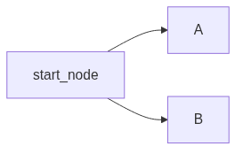
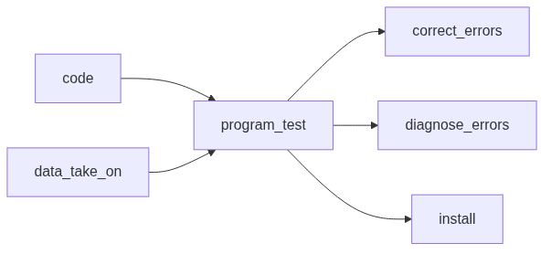
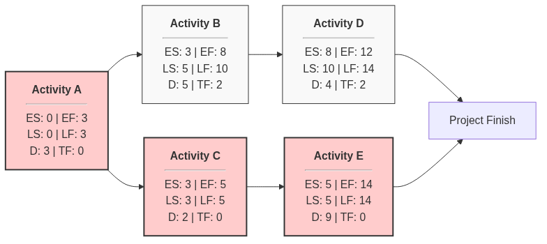
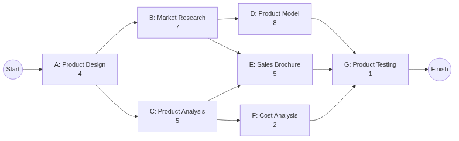

#+title: Software Engineering
#+SETUPFILE: /home/praaneshnair/.config/doom/templates/org/html-preamble.org

* Software Engineering

** Introduction

Software acts as both a product and a vehicle for delivering a product.
- *As a Product*: It manages, displays, and transmits information.
- *As a Vehicle*: It acts as a platform for other software (like an Operating
  System), controls other programs, or helps build new tools.

*** Fundamental Definition of Software
You can define a software as
- *Instructions* that provide desired features, functions and performance.
- *Data Structures* that enable programs to adequately manipulate information.
- *Documentation* that describes operation and use of programs.

*** Types of Software Applications
- *System Software* 
- *Application Software*
- *Engineering/Scientific Software* (a specific type of application software)
- *Embedded Software* (a specific type of system software)
- *Product line Software* (a collection/bundle/suite of application software)
- *WebApps* (applications which run on a browser)
- *AI Software* (specific type of application software which use AI)

*** Failure Models of Hardware and Software

**** Hardware
- Hardware is a physical system element, which starts with high failure rate
  (infant mortality), and then has a constantly low failure rate (steady state),
  and then later on again has a high failure rate due to wear-and-tear (wear
  out).
- The picture that depicts this is called the *bathtub curve*.
  file:/home/praaneshnair/gitProjects/org-notes/software-engineering/bathtub_curve.png
- When hardware components wear out, you can replace them with spare parts, but
  that doesn't change the failure rate overall.
**** Software
- Software can't wear out because it's a logical construct, not a physical
  entity.
- Software too, starts with high failure rate, but ideally should decrease and
  stay constant forever. 
- What actually happens is that any side-effect caused by an implementation,
  suddenly increases failure rate, and then as it's fixed, it goes down again.
  This keeps happening and is depicted by the below image.
  file:/home/praaneshnair/gitProjects/org-notes/software-engineering/software-wear.png
- There is no concept of spare parts here. Every failure reflects an error in
  design or process.
- So software maintenance is *harder* than hardware maintenance.
  
*** Legacy Software
**** What are they and why are they unchanged?
- These are software developed decades ago, but are still used because they're
  indispensable to the business.
- They often have *inextensible designs*, *convoluted code* and *poor change
  history/documentation*. 
- All in all, they are of *poor quality*.
- These are forgiven because they do the job. If it ain't broken, don't fix it.
  
**** When will you need to change them?
- Software must be adapted to meet new *computing needs*.
- They must be enhanced to implement new *business requirements*.
- They must be extended to make it *interoperable with modern systems*.

*** Newer Categories of Software
- *Ubiquitous Computing*: The concept of wireless networks
- *Netsourcing*: Using the internet as a computing engine
- *Open Source*: Source Code open to the computing community.

*** IEEE's Definition of Software Engineering
#+begin_quote
The application of a
- Systematic
- Disciplined
- Quantifiable
approach to the
- Development
- Operation and
- Maintenance
of software.
#+end_quote

*** Layers of technology

| *Tools:*         | What you use. Eg. Compilers, Database, programming languages, IDEs, etc                         |
| *Methods:*       | These include the things which make up a  workflow. Eg. Communication, Design Modeling, Testing |
| *Process:*       | This is a way of managing objectives and outcomes                                               |
| *Quality Focus:* | What matters the most in your app. Eg. Banks need correctness.                                  |

The last layer is what matters the most in engineering.

- A process is a collection of:
  - *Activity:* what you do to achieve a *broad objective*. (a phase)
  - *Action:* set of tasks
  - *Task:* Focuses on a small and well-defined objective that produces a tangible
    outcome.
- Processes hold everything together in any model.

** Process Models

*** Prescriptive/ Traditional 
- These are for large-scale projects.
- You prescribe a set of processes and workflows for projects. You focus on the
  process over the product.
- All requirements are clearly defined before implementation. This model favours
  anticipation, not adaptation.
- The organizational structure is linear.
- Clients and customers are involved all the time.
- Issues escalate to managers, and they are also the people who provides
  estimates.
  

**** Waterfall
***** What it is
\[ \text{Communication} \rightarrow \text{Planning} \rightarrow \text{Modelling} \rightarrow \text{Construction} \rightarrow \text{Deployment} \]

- Communication is talking with the client (project initiation and requirements
  gathering).
- Planning is about organizational structure (estimating, scheduling and
  tracking)
- Modelling is about planning the technical implementation (analysis and design)
- Construction is the actual implementation (code and test)
- Deployment is giving the final product (delivery, support and feedback)
  
***** When to use
- When requirements are stable and unlikely to change
- When resources are available throughout.
  
***** Disadvantages
- You have to finish a phase to move to the next one. 
- You can't go back a phase.
- You get an actual product only at the end of everything.

**** V-Process

***** What it is
file:/home/praaneshnair/gitProjects/org-notes/software-engineering/v-process.png
- Extends waterfall model by adding a testing phase.
- It emphasizes verification and validation.
- Testing is done in parallel to development.
- This ensures that the product meets the specifications.
- Each phase has specific deliverables, and the resources are well utilized.

***** When to use
- Requirements are clear and fixed.
- Scale is small
- But you also need early defect detection.

**** Incremental

***** What it is
file:/home/praaneshnair/gitProjects/org-notes/software-engineering/incremental.png
- Applies linear sequences in a staggered fashion
  
***** Advantages
- Users get working functionality early, even if the complete system isn't
  ready. This provides value sooner and allows for feedback.

***** When to use
- You have a large project that can be broken into modules
- Resources can be added gradually.
- Complexity is high but no uncertainty.

**** Rapid Application Development

***** What it is
file:/home/praaneshnair/gitProjects/org-notes/software-engineering/rad.png
- Even here, you need well defined requirements.

**** Prototypic / Evolutionary Process Models

***** What it is
- Prototypic
- It's the same waterfall model, but in a loop.
- You do it when requirements are not well understood.

***** Disadvantages
- To impress stakeholders, the prototype is often held together haphazardly,
  which means you haven't considered overall software quality.

**** Spiral Model
- It's evolutionary model, but risk analysis is introduced.
- Instead of being a loop, you move that line in a spiral shape.
- This is better for large scale projects.
- Each iteration includes
  - Planning
  - Risk analysis
  - Engineering
  - Evaluation

*** Agile Method
- These are for small-scale process.
- The whole premise is that you prioritize human outcomes over rigid system.
- The organizational structure is iterative, not linear.
- This model favors adaptation.
- Clients don't get involved that much, and customers don't get involved at all
  after the execution starts.
- Issues are handled by the entire team, and the scrum master facilitates all
  effort estimations.
- Refer to [[*Prescriptive/ Traditional][traditional approach]] to compare.

**** 4 values of Agile
These are 4 values to focus on quality.
- $\text{People and Interactions} >  \text{rigid processes and tools}$
- $\text{Working software} >  \text{Documentation}$
- $\text{Customer collaboration} >  \text{contract negotiation}$
- $\text{Responding to change} >  \text{sticking to a plan}$

**** 12 Principles
The 12 principles articulated in the Agile Manifesto emphasize creating a work
environment that focuses on the customer:
- Satisfying customers through early and continuous delivery of valuable work.
- Breaking big work down into smaller tasks that can be completed quickly.
- Recognizing that the best work emerges from self-organized teams.
- Providing motivated individuals with the environment and support they need and
  trusting them to get the job done.
- Creating processes that promote sustainable efforts.
- Maintaining a constant pace for completed work.
- Welcoming changing requirements, even late in a project.
- Assembling the project team and business owners on a daily basis throughout
  the project.
- Having the team reflect at regular intervals on how to become more effective,
  then tuning and adjusting behavior accordingly.
- Measuring progress by the amount of completed work.
- Continually seeking excellence.
- Harnessing change for a competitive advantage
  
Here are those pictorially:
file:/home/praaneshnair/gitProjects/org-notes/software-engineering/principlesscrum.png

**** Agile Scrum Methodology
- Scrum is a lightweight framework of Agile Project Management
- A sprint in Agile is the time-boxed period to complete an increment.

***** Three Pillars
- Transparency
- Inspection
- Adaptation

***** Scrum Artifacts
Scrum artifacts are information the team and stakeholders use to detail
- the product being developed
- the actions to produce it, and
- the actions performed during the project
 

| Product Backlog                                                    | Sprint Backlog                                                   | Increment                                                           |
|--------------------------------------------------------------------+------------------------------------------------------------------+---------------------------------------------------------------------|
| List of requirements of build in product aka. list of user stories | Set of product backlog items to be implemented in current sprint | Customer deliverables which were actually delivered during a sprint |

****** Epics
- They represent a big-picture vision

****** User Stories
- It's a requirement expressed in end-user POV
- These break epics down into actionable tasks.
- These include functional user stories (eg. can I save my order and come back
  to it?) and non-functional user stories (these are technical implementations
  of the functions like "can I place an order at ANY time?")
- They comprise of 3 elements: card, conversation and confirmation

******* Card
- User stories are printed on physical cards.
- The front tells us:
  - Who the primary stakeholder is (*As a* some role)
  - What effect does the story have (*I want* to do something)
  - What business value does this effect give the stakeholder (*so that* I can get some benefit)
- The back gives us *acceptance criteria* (the test cases which prove that the feature works as intended).
  
******* Conversation
Discuss details among stakeholders
  
******* Confirmation
Define acceptance criteria

****** Story Points
- They help quantify the complexity of a user story
- The numbers used are often part of the fibonacci sequence
- Larger the number, higher the complexity and the need to be broken down into
  smaller user stories.

***** Events

****** Backlog Grooming/Optimization
- The product owner optimizes the product backlog using feedback they get from
  users and development team.
- A good backlog should be *DEEP*: 
  - *Detailed Appropriately* (amount of detail used to describe them \propto how soon they're going to be delivered)
  - *Estimated* (estimation of work needed to deliver \propto how soon they're going to be delivered)
  - *Emergent* (backlog adapts to customer needs)
  - *Prioritized* (backlog items are ranked according to business value)

****** Sprint Planning
- To make the sprint backlog, the development team conducts this meeting.
- Specific user stores are added to the sprint backlog, from the product
  backlog.

****** Daily Scrum/ Standup
- It's a meeting of about 15 minutes every day to make sure everyone is on the
  same page.
- The common questions are:
  - What did I do yesterday?
  - What do I plan to do today?
  - Are there any obstacles?
   
****** Sprint
- The time taken to finish an increment
- It's typically two weeks long
- The more complex the work is, the more shorter the sprint should be.

****** Sprint Review
- At the end of a sprint, the team showcases the increment to the stakeholders
  and teammates.
- The product owner can chose if they want to release the increment or not.
- For a 1 month long sprint, a sprint review should take not more than 4 hours.

****** Sprint Retrospective
- The team comes together to discuss what went well, what didn't, and how things
  can be improved.

***** Roles

| Product Owner                                                                                                                           | Scrum Master                                               | Development Team                                   |
|-----------------------------------------------------------------------------------------------------------------------------------------+------------------------------------------------------------+----------------------------------------------------|
| Client. They build the product backlog, perform backlog grooming and can also choose to release sprint increment or not                 | Coaches the team on scrum principles                       | Delivers a shippable increment during every /sprint/ |
| They are an individual not a group. Else the development team would be getting mixed guidance                                           | They understand the work and help in improving efficiency. | They train each other and are self-organizing.     |
| They work with stakeholders and customers to make epics, then they work with the development team to break them down into user stories. |                                                            |                                                    |
 
** Requirements Engineering 

*** 7 Tasks of a Requirement Engineer

**** Inception
- Understand the problem
- Identify stakeholders

**** Elicitation
Gather details 
***** Collaborative Requirements Gathering
- A facilitator (customer/developer) conducts a meeting to negotiate different
  approaches.
***** Quality Function Deployment
- Translate needs of customer \rightarrow technical requirements for software
- Three types of requirements:
  | Normal                               | Expected                                                                                            | Exciting                                         |
  |--------------------------------------+-----------------------------------------------------------------------------------------------------+--------------------------------------------------|
  | Goals stated for product by customer | Implicit requirements that might be fundamental enough for the customer to not tell them explicitly | Requirements for features customer didn't expect |

**** Elaboration
- Build a analysis/technical model and develop use cases.
- An analysis model is a snapshot of requirements at a specific point of time.
- There are majorly 4 categorizations of models:
  - Scenario based models (use case and user stories)
  - Class based models (class diagrams from OOPS)
  - Behavioural Models (state diagrams)
  - Flow Models (eg. DFDs, data models)
  

***** Use Case Diagram
  Here's an example of a use case diagram:
  file:/home/praaneshnair/gitProjects/org-notes/software-engineering/usecasediagram.png
- There are 4 symbols in a use case diagram:
  - Actor (Outside the box)
  - Use Cases (Ellipses)
  - Associations (lines/arrows connecting actors and use cases)
  - System Boundary (rectangle, which indicates scope)
- In UML, if we include a label ~<< include >>~ on an association/relationship, it
  means the use case is mandatory. If we use this label, the arrow becomes
  dotted.
- Similarly if we include a label ~<< extend >>~ on an association/relationship,
  it means the use case is optional. Here too, the arrow is dotted.
  file:/home/praaneshnair/gitProjects/org-notes/software-engineering/uml.png
  
***** State Diagram
- A *state diagram* looks like this:
  file:/home/praaneshnair/gitProjects/org-notes/software-engineering/statediagram.png
  
***** Data Flow Diagram
- *Rectangle*: Producer of Data
- *Circle*: This is a function that takes data as input, processes it and gives
  output.
- *Arrows*: For data flow
- *Parallel Lines*: Text written inside parallel lines means it's data stored for
  later use.

**** Negotiation
- Using the technical model we've built, we evaluate the *feasibility* of what the
  customer wants, *rank* the requirements, and evaluate the *risks*, iteratively.

**** Specification
- Make the *Software Requirement Specification* (SRS) document.
- This contains all functional and non-functional requirements.
***** Functional Requirements
- Functional requirements list all the functions of the website, and tells us
  how it works in general.
- These are things the end-user specifically demands.
***** Non-Functional Requirements
- Non-functional requirements list technical implementations of functional
  requirements. They could be related to *performance*, *scalability*, *security*,
  *usability*, etc.
- Any performance criteria (eg. 99.9% uptime), constraints (eg. 1000
  transactions per seconds) are included here.
  
****** Execution Qualities 
- These are things observable during runtime.
- Eg. Security, usability

****** Evolution Qualities
- These consist of things like testability, maintainability, scalability that
  are embodied in the static structure of the system.
  

**** Validation
- Validate the requirements presented in SRS.

***** Decision Tables

| Condition Stubs                      | Condition Entries         | Action Stubs                              | Action Entries                                      |
|--------------------------------------+---------------------------+-------------------------------------------+-----------------------------------------------------|
| Variables that affect the system     | Values of condition stubs | Outcomes of system                        | Indicators of whether an action was executed or not |
| Eg. Input, User Roles, System states | Eg. yes/no, numeric, text | Eg. Updating db entry, printing a message | Eg. X, O, Blank                                     |

Eg.
file:/home/praaneshnair/gitProjects/org-notes/software-engineering/decisiontable.png
***** Decision Tree
- The leaf nodes represent actions to be performed.

**** Requirements Management Task
Make a *requirement traceability matrix (RTM)*

***** Forward Traceability Matrix
Maps Requirements \rightarrow Test Cases and Project Deliverables

***** Backward/Reverse Traceability Matrix
Maps Test Cases and Project Deliverables \rightarrow Requirements

***** Bidirectional
Maps both ways.

** Design Engineering

*** McGlaughin's Characteristics
- Implement all implicit/explicit requirements by stakeholders.
- Design should be a readable, understandable guide.
- Design should give a complete picture of the software.

*** Functional Independence

**** Cohesion
- Degree to which elements inside a module work together.
- functional strength of a module
- More cohesion means elements are more closely related and they all work
  towards the same goal.
- Higher the cohesion, the easier the system is to maintain.

***** Functional Cohesion
- Everything needed is readily available in the module.
- This is the ideal case.

***** Sequential Cohesion
- The output of an element is the input of another. 
- Data flows between the parts.

***** Communicational Cohesion
- Two elements operate on the same input data or contribute towards the same output data.

***** Procedural Cohesion
- It's not data flow, but it's still in order.

***** 

**** Coupling
- Degree of Interdependence among modules
- More the coupling means more interconnectivity and this means it's harder to
  maintain.

***** Data Coupling
- Only data moves around
- The components are independent of each other
- There is no /tramp data/. Tramp data is where data moves from one function to
  another through intermediary functions, and those functions don't use this
  data.

***** Stamp Coupling
- Data structures move around. 
- This contains tramp data, but it could have been for efficiency sake too.

***** Control Coupling
- Modules communicate via control information/parameters.

***** External Coupling
- Depends on external modules, not part of the system.

***** Common Coupling
- Modules have shared data like global data structures.
- Reusing modules or controlling data access is an issue.

***** Content Coupling
- One module can modify the data of another module.
- This is the worst form of coupling.

* Software Project Management

** Software Project vs Job
- A *software project* is a planned development of a software product. It includes
  $$Designing \rightarrow Coding \rightarrow testing \rightarrow Deployment$$
- A *job* is a repetition of a very well-defined and well understood tasks with
  very little uncertainty. A project, however, is a little more uncertain and is
  a little more exploratory.
- A task is more project-like, it's:
  - non-routine
  - planned
  - aimed at a specific gtarget
  - work carried out for a customer other than yourself
  - involving several specialisms
  - made up of several different phases

** Software Project Management
- *Software project management* is the process of planning, organizing and
  controlling software projects. It includes:

  | (1) Feasibility Study                               | \rightarrow | (2) Planning                       | \rightarrow | (3) Execution       |
  |-----------------------------------------------------+---+------------------------------------+---+---------------------|
  | Check if it's technically and financially feasible. |   | Make a plan only if it's feasible. |   | Implement the plan. |
  
- It ensures that the software:
  - is delivered on time
  - is within budget 
  - meets user requirements
- Project Management is managing:
  - People
  - Time 
  - Cost
  - Resources 
- Software projects are different from other projects through:
  1. *Invisibility*: Software can't be physically seen or touched like a building
     or a car.
  2. *Complexity*:
  3. *Conformity*: Must conform to some rules. For example, a banking application must conform to rules set by RBI.
  4. *Flexibility*:
     
** Defining Managment

| *Planning*     | Decide what's to be done                                     |
| *Organizing*   | Make Arrangements                                            |
| *Staffing*     | Selecting the right people                                   |
| *Directing*    | Giving instructions to them                                  |
| *Monitoring*   | Check progress                                               |
| *Controlling*  | Taking action to remedy hold-ups (clear blockages)           |
| *Innovating*   | Coming up with solutions when problems arise                 |
| *Representing* | Talking to clients, users, developers and other stakeholders |

** Objectives
They should be SMART:

| *S* | Specific         |
| *M* | Measureable      |
| *A* | Achievable       |
| *R* | Relevant         |
| *T* | Time Constrained |

** Cost-Benefit Evaluation Techniques
- $\text{Payback Period} = \text{total number of years} + \frac{\text{amount remaining}}{\text{cashflow for next year}}$
- $\text{Return of Interest} = \frac{\text{Average Annual profit}}{\text{Total Investment}} \times 100$
- $\text{Discount Factor} = \frac{1}{(1+r)^{t}}$
- $\text{Discounted Cashflow} = \text{Cashflow} \times \text{Discount Factor}$
- $\text{Net Profit}  = \text{The difference bteween the total costs and the
  total income over the life of the project} = \Sigma \text{(Discounted Cashflow)}$

  
** Example
XYZ Software solutions has recieved funding to develop only one software project
this year. The management is evaluating two projects:
- Project A: Hosptital Management System
- Project B: Online Learning Management System

| Year | Project A  | Project B |
|------+------------+-----------|
|    0 | -10,00,000 | -8,00,000 |
|    1 | 2,00,000   | 1,50,000  |
|    2 | 2,50,000   | 2,00,000  |
|    3 | 3,00,000   | 2,50,000  |
|    4 | 3,50,500   | 2,50,000  |
|    5 | 5,00,000   | 3,50,000  |

*** Calculate Cash Inflow

*** Calculate Net Profit 
- $\text{Net Profit}  = \Sigma(Profit per year) - (Initial amount invested)$
- $\text{Net Profit}_{A}  = 16,00,000 - 10,00,000$
- $\text{Net Profit}_{A}  = 6,00,000$
- $\text{Net Profit}_{B}  = 16,00,000 - 8,00,000$
- $\text{Net Profit}_{B}  = 8,00,000$

** Network Planning Model
- It is used to plan and schedule project activities and their relationship as a
  network.
- The flow is from left to right.
- Identify which activity to complete first. There are many techniques for this.
*** Types
**** Critical Path Method (CPM)
**** Program Evaluation and Review Technique (PERT)
**** Activity on Arrow (AoA) approach.
- Arrows represent activities
- Nodes (circles) represent events

*** Formulating a Network Model
- A project network should have only one start node.
  #+begin_src mermaid :file network_model.png :results file
graph LR
    start_node --> A
    start_node --> B

  #+end_src

  #+RESULTS:
  

- A node has a duration.
- Time moves from left to right and the flow represented as flow. 
- Immediately preceding activities are called *precedents*.
  #+begin_src mermaid :file precedence_graph.png :results file
graph LR
    code --> program_test
    data_take_on --> program_test
    program_test --> correct_errors
    program_test --> diagnose_errors
    program_test --> install
  #+end_src

  #+RESULTS:
  
- A loop is an error that represents a situation that cannot happen in practise.
  (there can't be loops coz time only move forward).
- Here's what a typical precedence graph looks like:
  #+begin_src mermaid :file typical.png :results file
graph LR
    %% Define Node Styles
    classDef critical stroke:#333,stroke-width:2px,fill:#ffcccc;
    classDef standard stroke:#333,stroke-width:1px,fill:#f9f9f9;

    %% Nodes with internal layout
    A["<b>Activity A</b>
ES: 0 | EF: 3 LS: 0 | LF: 3 D: 3 | TF: 0"]:::critical
    B["<b>Activity B</b>
ES: 3 | EF: 8 LS: 5 | LF: 10 D: 5 | TF: 2"]:::standard
    C["<b>Activity C</b>
ES: 3 | EF: 5 LS: 3 | LF: 5 D: 2 | TF: 0"]:::critical
    D["<b>Activity D</b>
ES: 8 | EF: 12 LS: 10 | LF: 14 D: 4 | TF: 2"]:::standard
    E["<b>Activity E</b>
ES: 5 | EF: 14 LS: 5 | LF: 14 D: 9 | TF: 0"]:::critical

    %% Dependencies
    A --> B
    A --> C
    B --> D
    C --> E
    D --> End[Project Finish]
    E --> End

  #+end_src

  #+RESULTS:
  

*** Information within a Block

**** Early Start: $ES$
- The earliest possible time a task can begin, assuming all previous tasks are
  finished.
- Earliest start time for the current activity is basically the earliest start
  time of the precendent activity.
- The earliest start time for activities with no precedents is 0.

**** Early Finish: $EF = ES + \text{Duration}$

**** Late Start:

**** Late Finish:

*** Forward Pass
- The forward pass is carried out to calculate the earliest dates on which each
  activity may be started and completed.
- It's a technique used in project scheduling/ critical path method (cpm) to
  determine the earliest time at which any activity is started.
- Calculating ~ES EF~ is one forward pass.

*** Backward Pass
- The backward pass is performed from Finish back toward the start. 
- Its purpose is to calcualte the lates dates on which each activity can start
  and finish without delaying the project.

*** A project comprises of the following activities given in the table

| Activity ID | Description      | Duration | Intermediate Predecessor |
|-------------+------------------+----------+--------------------------|
| A           | Product Design   |        4 | None                     |
| B           | Market Research  |        7 | A                        |
| C           | Product Analysis |        5 | A                        |
| D           | Product Model    |        8 | B                        |
| E           | Sales Brochure   |        5 | B, C                     |
| F           | Cost Analysis    |        2 | C                        |
| G           | Product Testing  |        1 | D, E, F                  |

**** Construct an Activity on Node Network which will provide an overview of the planned project?
#+begin_src mermaid :file ques.png :results file
flowchart LR
    S((Start)) --> A[A: Product Design 4]
    
    A --> B[B: Market Research 7]
    A --> C[C: Product Analysis 5]
    
    B --> D[D: Product Model 8]
    B --> E[E: Sales Brochure 5]
    
    C --> E
    C --> F[F: Cost Analysis 2]
    
    D --> G[G: Product Testing 1]
    E --> G
    F --> G
    
    G --> T((Finish))
#+end_src

#+RESULTS:

**** How soon could the project be completed?

| Activity | Duration | ES | EF |
|----------+----------+----+----|
| A        |        4 |  0 |  4 |
| B        |        7 |  4 | 11 |
| C        |        5 |  4 |  9 |
| D        |        8 | 11 | 19 |
| E        |        5 | 11 | 16 |
| F        |        2 |  9 | 11 |
| G        |        1 | 19 | 20 |

**** Which activities need to be completed on time in order to ensure that the projectis completed without delay any overdue on time?

**** Compute the free float and interfereing float for each activity.
